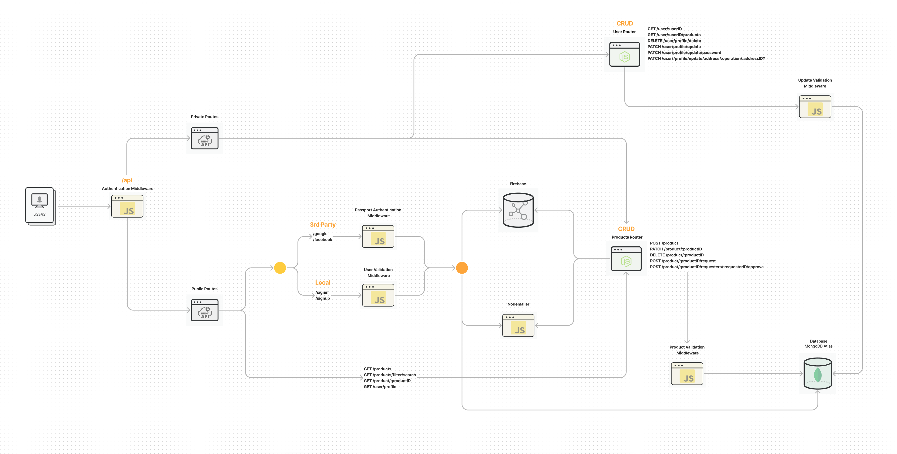
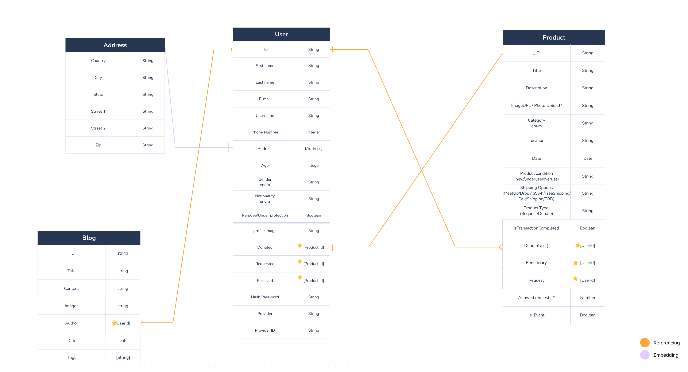

# Let's Share API

## _A sharing and Posting API_

<p align="center">powered by</p>
<p align="center">

</p>

[](https://travis-ci.org/joemccann/dillinger)

# 🔬 Description

> "Let's Share" encourages people who live in the same region to share their extra electronics, clothes,
> furniture, etc.<br>
> Let's Share is an API that allows people to post donation and request posts
> where one order request can be approved to take the product.

# ⚙️ Demo

Server link: [Let's Share API]

# 🧱 Features

- Signin/Signup authentication
- 3rd Party authentication (Google, Facebook)
- List products
- CRUD operations for products
- CRUD operations for users
- Donate products
- Request products
- Filter products by category
- Search products
- Middleware for validation and error handling

# 🦾 Team

### Lead board

- 🧔🏻 [Halit Batur]
- 🧔🏻 [Muslim Omar]

### Developers

- 👩🏻 [Noor Awied]
- 👩🏻‍🦱 [Ezgi Okur]
- 👩🏻‍🦱 [Nilay Aydin]
- 👨🏻 [Adnan Khaldar]
- 🧔🏻 [Amjad Khatib]

# 🛠 Tech

Let's Share uses a number of open source modules to work properly:

- [ExpressJS] - a fast Node.js network app framework.
- [Node.js] - an evented I/O for the backend.
- [VSCode] - an awesome web-based text editor.
- [Heroku] - a cloud platform as a service.
- [Nodemailer] - a module for Node.js applications to allow easy email sending.
- [Nodemon] - automatically restarting the node application when file changes in the directory are detected.
- [MongoDB] - a source-available cross-platform document-oriented database program.
- [PassportJS] - an authentication middleware for Node.js.
- [Swagger] - build, document, test and consume RESTful web services.
- [JWT] - a compact URL-safe means of representing claims to be transferred between two parties.
- [Chai] - BDD / TDD assertion library for Node.js.

# 🌆 Screenshots

### System Structure



### Database Schema



# 🕹 Installation

Let's Share requires [Node.js](https://nodejs.org/) v10+ to run.

Install the dependencies and devDependencies and start the server:

```sh
cd backend-capstone-turkey-lets-share
yarn install
```

For production environments:

```sh
yarn install --production
NODE_ENV=production
```

### Starting the server

To start with node:

```sh
yarn start
```

To start with nodemon:

```sh
yarn dev
```

# 📦 Contributing

Contributions are what make the open source community such an amazing place to be learn, inspire, and create. Any contributions you make are **greatly appreciated**.

1. Fork the Project
2. Create your Feature Branch (`git checkout -b feature/AmazingFeature`)
3. Commit your Changes (`git commit -m 'Add some AmazingFeature'`)
4. Push to the Branch (`git push origin feature/AmazingFeature`)
5. Open a Pull Request

# 🔑 License

MIT

**Free Software, Hell Yeah!**

[//]: # "These are reference links used in the body of this note and get stripped out when the markdown processor does its job. There is no need to format nicely because it shouldn't be seen. Thanks SO - http://stackoverflow.com/questions/4823468/store-comments-in-markdown-syntax"

# 📬 Contact

[lets.share.capstone@gmail.com](lets.share.capstone@gmail.com)

[let's share api]: https://lets-share-capstone.herokuapp.com/#/
[expressjs]: https://expressjs.com/
[node.js]: http://nodejs.org
[vscode]: https://code.visualstudio.com/
[heroku]: https://www.heroku.com/
[nodemailer]: https://nodemailer.com/about/
[nodemon]: https://www.npmjs.com/package/nodemon
[mongodb]: https://www.mongodb.com/
[passportjs]: https://www.passportjs.org/
[swagger]: https://swagger.io/
[jwt]: https://jwt.io/
[chai]: https://www.chaijs.com/
[halit batur]: https://github.com/halitbatur
[muslim omar]: https://github.com/muslimomar
[noor awied]: https://github.com/awiednoor
[ezgi okur]: https://github.com/okurezgi
[nilay aydin]: https://github.com/niloaydin
[adnan khaldar]: https://github.com/khaldarov
[amjad khatib]: https://github.com/khatibAmjad
